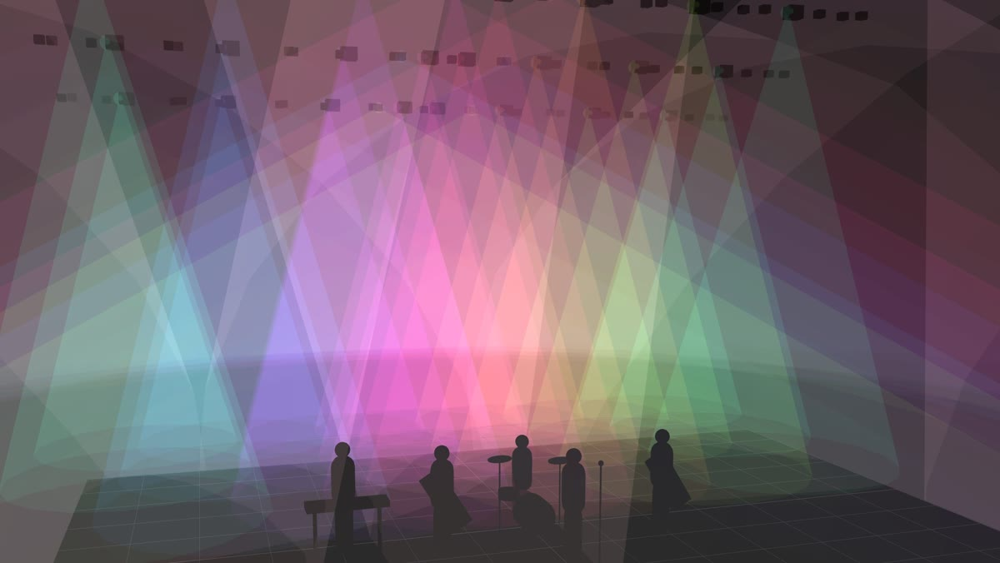
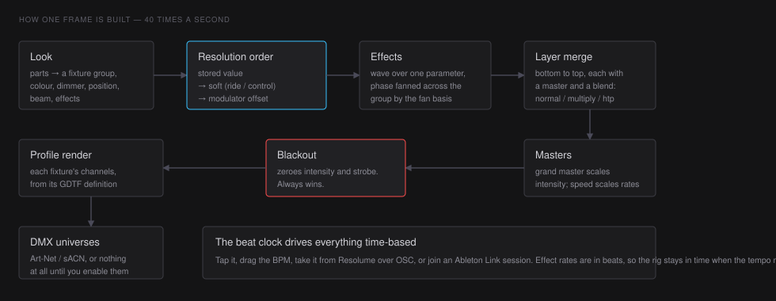

# What LIGHT is

LIGHT is a lighting console that runs beside Resolume. It drives DMX fixtures
from a grid of pads, in time with the music, and it is built for one person
running a show from a laptop at front of house.

It is not a plot-and-cue-stack desk. There is no cue number to step through and
no tracking sheet. There is a grid: rows are **layers**, columns are the
**sections of a song**, and each pad holds a **look**. You fire looks, or you
fire a whole column as a cue, and the rig follows the beat.

## The mental model

- A **look** is a lighting state — colour, intensity, position, beam and effects
  for one or more fixture groups. Looks live in one pool shared by the whole
  show, so the same wash can sit on a pad in twelve songs.
- A **layer** is a row. Layers merge bottom to top, each with its own master and
  blend mode, exactly like video layers in Arena.
- A **deck** is a song. The chips under the top bar are pages of the grid, one
  per song, and the APC40's bank arrows step through them.
- A **column** is a cue. Firing one fires every layer's pad in that column *and
  clears the layers whose pad is empty*, so a column fully describes the stage.
- Everything time-based — effect rates, fades measured in beats — follows the
  **beat clock**.

## How one frame is built

Forty times a second, for every fixture head in the rig:

Two things in that chain are worth holding on to.

**The resolution order is stored → soft → modulation.** The value saved in the
look is the floor. On top of it sits the *soft* layer: a fader you are riding,
or a named control someone is moving. On top of that sits any modulator offset.
Nothing you do live rewrites the show until you say so, which is what makes it
safe to grab a fader mid-song.

**Blackout is not a look.** It is applied after the merge and after the masters,
it zeroes intensity and strobe, and it always wins. Layers keep running
underneath it, so releasing it puts the stage back exactly where it was.

## What it talks to

- **DMX** over Art-Net and sACN, as many universes as the rig needs. Both are
  off until you turn them on, so the app never surprises a rig.
- **Resolume**, over OSC: Arena's tempo and downbeat drive the clock, and column
  launches in Arena fire the matching cue in LIGHT.
- **MIDI**, for an APC40 or anything else — pads fire looks, faders and encoders
  ride parameters, and everything is learnable in three clicks.
- **Ableton Link**, to share a tempo with everything else in the room.

## Two engines, one answer

There are two implementations of the show engine: a TypeScript reference and the
Rust core that ships in the app. They are held byte-identical by a parity test
that boots both and compares the DMX they produce. That sounds like an
implementation detail and mostly is — but it is the reason the numbers in this
documentation can be stated exactly, and the reason a change to how a fan is
computed is caught before it reaches a stage.

## What it will not do

- It will not stop you mid-show. No licence check, no dialog, and no error state
  blocks a cue from firing.
- It will not send DMX you did not ask for. Outputs are off by default in every
  new show.
- It will not save your live state. A restart comes up dark: no looks running,
  no blackout armed, masters where the show says they are. That is deliberate —
  the alternative is an app that turns a rig on while you are plugging it in.
