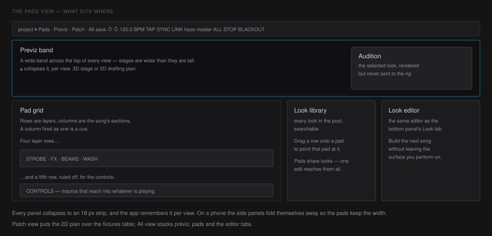

# The console

Four layouts, chosen with the buttons next to the project name or with
`⌥1`–`⌥4`. Alt rather than plain digits, because `1`–`9` fire cues and a mis-hit
that changes the layout is cheap while a mis-hit that fires the wrong cue is not.

| View | For | What is on screen |
|---|---|---|
| **Pads** `⌥1` | running the show | previz band, pad grid, look library, look editor |
| **Previz** `⌥2` | pointing the rig, or a second screen at FOH | previz, full window |
| **Patch** `⌥3` | before doors | 2D plan over the fixtures table |
| **All** `⌥4` | building | previz, pads, and the editor tabs |

## The previz band

The previz is a band across the **top** of every view. Rigs and stages are wider
than they are tall, so that is the shape that reads; a tall narrow previz spends
its pixels on empty air above the truss.

`▴` at the left of the previz bar collapses it to an 18 px strip, and the app
remembers that **per view** — hide it on the pads to perform full-height and the
patch view still opens with its plan. The strip brings it back.

The band is unmounted, not hidden, when collapsed. A previz left running behind
another panel keeps a WebGL context and an animation loop alive for a view
nobody is looking at, which on a laptop driving a show is real battery.

## The audition pane

When a pad is selected, the right edge of the band shows that look **rendered
but not sent** — the engine resolves it into a separate head set that never
reaches DMX. It is how you check a look mid-song without putting it on stage.

It is a second renderer, and selecting a pad is something firing one does, so
the `preview` button in the previz bar switches it off for a show run from the
pads.

## The look library

Bottom right of the pads view: every look in the show's pool, searchable, each
row showing a colour swatch and a `×N` count of how many pads in the current
song already use it.

**Drag a row onto a pad** and that pad points at the look. Pads *share* looks —
one edit reaches every pad using it, across every song — which is the whole
point of a pool and the reason the count is worth showing before you drag.

A drag carries the song it started in. If a deck switch lands mid-drag — an APC
bank arrow, or another client — the drop is refused rather than written into
whatever song is now on stage.

## The look editor

Rightmost column in the pads view, and also the `Look` tab of the bottom panel
in the All view. Same editor, same selection, two homes: you can build the next
song without leaving the surface you perform from.

## Panels and space

Both side panels collapse (`▸`) and both remember it. Below about 810 px of
window width only one of the two fits beside a usable grid, so opening one folds
the other; on a phone both fold and the pads keep the width. The engine serves
this same interface over HTTP, so a phone on the floor is a real use of it.

Drag the seams to resize. In the All view the previz and the editor cannot
squeeze the pads out between them — the grid keeps a floor, and whichever seam
you are dragging is the one that wins.

## When something goes wrong

Each panel is its own error boundary. If the previz throws, the previz says so
and offers to rebuild itself; the grid, the masters and blackout keep working.
Nothing on stage changes when a panel crashes.

Two bars appear when they need to:

- **ENGINE OFFLINE** — the socket dropped. Nothing you press is reaching the rig.
- **ENGINE STALLED** — connected, but the show engine has stopped answering.
  The more dangerous of the two, because everything looks normal.
