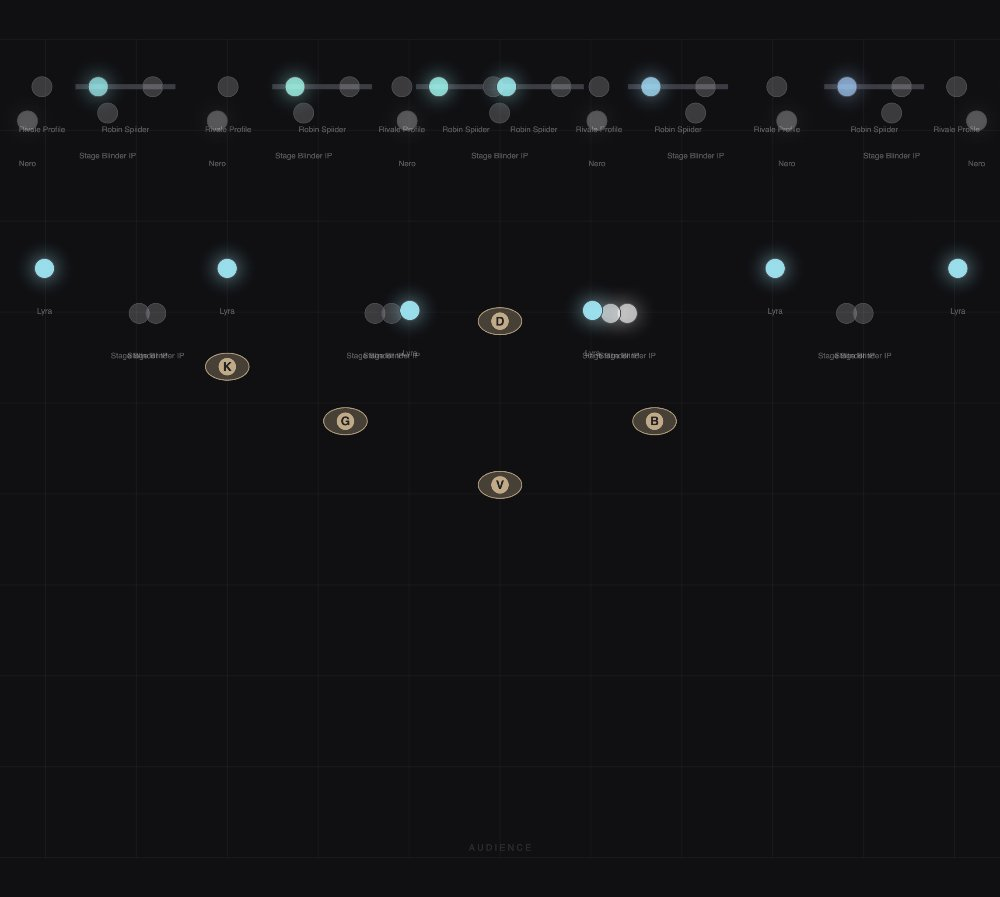

# Patching and fixtures

The **Patch** view (`⌥3`) puts the 2D plan over the fixtures table, because
patching is drag-a-row-into-the-plan and the two have to share a screen.

## The table

One row per fixture: name, profile, universe, address, and its position and aim
in the room.

- Number fields accept typed values including negatives, or **drag left/right on
  the field to scrub**.
- Select rows first — click, ⇧-click for a range, ⌘-click to toggle, or drag a
  box — and any edit applies to the whole selection.
- With rows selected the toolbar offers `→ universe`, `⇢ re-address`,
  `⧉ duplicate`, `✕ delete` and `⊕ group from N selected`.

Address conflicts are flagged in the table. A fixture whose profile is missing
is marked as well: it renders as nothing at all until you give it one.

## Position and aim

`Rot°` is yaw, `Tilt°` the mounting pitch, `Roll°` the roll. They compose on top
of each fixture type's default aim, so a bar hung at an angle points where it
actually points — and the previz and every position effect agree with the rig.

In the **2D plan**, drag a fixture to place it; `⌥`-drag rotates. Drag near a
truss bar with `snap` on and it clamps onto the bar and rigs there, so moving
the bar later moves everything on it. The **Front** elevation is the same view
from the side, where a drag sets *trim height* rather than position.

## Groups

A group is a named set of heads, and groups are what looks point at. Their
**order is chase order** — the sequence a chase or a fan by `index` runs
through — so it is worth arranging.

`⟳` generates groups automatically: one per fixture type, one per truss bar.
Promote one to a hand-made group and regeneration leaves it alone.

## Profiles

A profile describes how a fixture's channels work: which offset is dimmer, how
the colour is mixed, what parks where. LIGHT ships profiles for the fixtures it
was built against and imports the rest from **GDTF**.

### Importing GDTF

Import a `.gdtf` and every DMX mode inside it becomes a profile you can select
in the table. The importer maps the standard attributes — dimmer, pan/tilt,
RGB/W, shutter, and the beam parameters zoom, focus, iris, frost and CTO — onto
the parameters the look editor offers.

Attributes are matched including their indexed spellings: GDTF writes `Dimmer`
on a single-instance geometry and `Dimmer1`, `Dimmer2` … when it is indexed, and
both count. This matters more than it sounds: an unmatched attribute compiles to
a channel that drives *nothing*, which is a fixture that never lights and never
says why.

Pixel geometry is read out of the file where it exists, so a multi-pixel fixture
arrives with its real layout and `row`/`col` fans work immediately.

### Importing MVR

An MVR brings a whole scene: fixtures, addresses, positions and the GDTF
definitions embedded in it. It is the fastest way to get a designer's plot into
LIGHT.

Be careful with what comes out the other side. MVRs are frequently exported by a
console that writes **flat, minimal fixture definitions** — a name, a channel
count, and nothing that drives anything. LIGHT flags those:

- **Placeholder profile** — a definition with essentially only dimmers behind it.
  It works as a dimmer and does nothing else.
- **Undriven beam channels** — the profile lists zoom, focus, iris, frost or CTO
  by name but has no function behind them, so the look editor cannot offer those
  controls. The look editor says so where the faders would be.

The fix for both is the same: fetch the real definition from **GDTF Share** (or
the manufacturer) and re-import it, then point the fixtures at the new profile.

### Re-importing

Re-importing a corrected file **replaces** the stored profile, which rewrites
what every patched address means — correct, and the whole point, but never
silent: the app announces what changed. A layout you have hand-edited is kept if
the incoming file has nothing better to say about it.

Profiles are compiled into the project file and travel with the show. That is
also why they can go stale: a profile imported a year ago stays exactly as it
was compiled then. If controls are missing that the fixture obviously has,
re-import it.

## Pixel layouts

Multi-head fixtures carry a pixel layout — where each emitter physically sits.
The layout editor offers **strip**, **grid** (wired serpentine, as real matrix
panels are) and **ring**, and writes the result onto the profile so every
fixture using it inherits the positions.

The layout is what `row`/`col` fans and the previz read, so getting it right
once makes every pixel effect behave on every fixture of that type.
