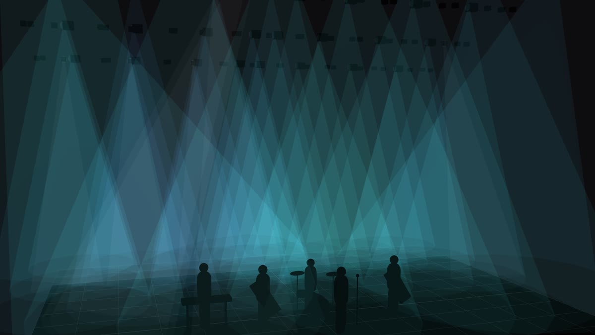

# Previz

Two renderers, for two different questions.

## The 3D stage

What the rig looks like from the room: beams through haze, colour on people,
shadows where they land. It is for judging whether a look *works* — whether the
wash reaches the drummer, whether two beams collide, whether a colour reads at
all against the LED wall.

- **band** puts dummy performers on stage for scale and to catch light.
- **beam viz** scales how strongly the beams render, independent of the rig's
  own haze value.
- **auto exp** is eye adaptation, on by default. Drag to orbit, scroll to zoom.
  The camera is remembered.

### Auto exposure

Beams are additive, so on a rig this size a full look piles up far past white
and the view turns into a flat sheet — exactly when you most need to see what
it is doing. `auto exp` stops the picture down the way your eyes do walking
into a bright room, and opens it back up in the quiet parts.

It is **partial** on purpose: a look with three and a half times the light on
stage still reads about 1.7× brighter, so you can tell a Drop from a Build.
Stopping down is fast and opening up is slow, which is both what an eye does and
what stops a strobe pumping the whole frame. A blackout is never brightened —
"is the rig actually out?" has to stay answerable at a glance.

Switch it off to judge absolute levels, or to compare two looks side by side
without the view re-metering between them.

Moving heads aim: pan and tilt from the look, and from any effect or control
driving them, steer the beams live. That includes fixtures whose emitters are
pixels rather than a single lamp — a moving wash with a pixel ring pans as one
head, which is what it does on the truss.

## The 2D plan

The drafting view. Top-down by default, with a **Front** elevation for trim
heights. This is where fixtures get placed, snapped to truss and grouped, and
where a metre grid (`measure`) makes it possible to judge sizes by eye.

Selection is shared with the patch table: select rows in the table and they
light up in the plan, and `⊕ group from N selected` turns a marquee into a
group.

`+ musician` drops dummy performers; `+ structure` draws truss bars, legs,
risers and screens. Structure is real geometry — beams terminate on it, and
moving a truss bar moves everything rigged to it. Stand a musician inside a
riser's footprint and they stand on top of it, kit and all, in both 3D views;
the plan tags them with the height. There is nothing to set, and moving or
resizing the riser moves whoever is on it.

## The audition pane

The right edge of the previz band shows the **selected** look rendered but never
sent to the rig — a separate head set the engine resolves alongside the live
one. It is how you check the next look mid-song.

It is a second renderer, and firing a pad selects it, so `preview` in the previz
bar switches it off when you want the live view to have the whole band.

## The native window

`PREVIZ` in the top bar opens a separate, natively rendered window: volumetric
haze, real shadow-casting beams, bloom. It speaks the same protocol as the
browser view and follows the same show.

It is the one to put on a second screen, and the one to trust for "will this
look right in the room". The in-app 3D view is deliberately cheaper — it shares
a laptop with the console.

Shadow casting is budgeted rather than unlimited: on a large rig every
shadow-casting beam costs its own depth pass, so the budget keeps them where
they read and drops them where they do not.
